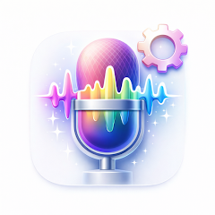

<p align="center">
  
</p>

<h1 align="center">EchoForge — Stimmenverzerrer</h1>

<p align="center">
  <b>Der zu 100% offline arbeitende Stimmenverzerrer. 24 Effekte, anpassbare Effektketten und direktes Teilen an WhatsApp, Telegram, Discord. Keine Werbung, kein Internet, kein Tracking. iOS und Android.</b>
</p>

<p align="center">
  <a href="https://play.google.com/store/apps/details?id=com.tomas.echoforge_voice_changer">
    
  </a>
  <a href="https://apps.apple.com/us/app/id6761810177">
    
  </a>
</p>

<p align="center">
  
  
  
  
  
  
</p>

<p align="center">
  <b>Sprachen:</b>
  <a href="README.md">English</a> · <a href="README.es.md">Español</a> · <a href="README.pt-BR.md">Português</a> · <a href="README.fr.md">Français</a> · <a href="README.it.md">Italiano</a> · <a href="README.nl.md">Nederlands</a> · <a href="README.pl.md">Polski</a> · <a href="README.cs.md">Čeština</a> · <a href="README.uk.md">Українська</a> · <a href="README.ru.md">Русский</a> · <a href="README.tr.md">Türkçe</a> · <a href="README.ar.md">العربية</a> · <a href="README.hi.md">हिन्दी</a> · <a href="README.zh-CN.md">中文</a> · <a href="README.ja.md">日本語</a> · <a href="README.ko.md">한국어</a> · <a href="README.id.md">Bahasa Indonesia</a> · <a href="README.vi.md">Tiếng Việt</a> · <a href="README.th.md">ภาษาไทย</a>
</p>

---

## Was ist EchoForge?

**EchoForge** ist ein vollständig offline arbeitender Stimmenverzerrer für Android und iPhone. Stimme aufnehmen, einen von 24 sorgfältig abgestimmten Effekten anwenden (oder eine eigene Effektkette bauen) und das Ergebnis direkt an Messenger teilen. Aufnahme, Verarbeitung und Audio-Codierung laufen auf dem Gerät. Keine Werbung, kein Konto, keine Internet-Berechtigung, kein Tracking.

Das Besondere: **stapelbare Effektketten**. Pitch, Reverb, Echo, Distortion, Bitcrush und mehr lassen sich kombinieren, per Drag-and-Drop sortieren und als eigene Stimme speichern. Die meisten Apps stecken so ein Feature hinter ein Abo. EchoForge bleibt kostenlos.

## Hauptfunktionen

### 24 Stimmen-Presets
- **Helium**, **Chipmunk**, **Roboter**, **Dämon**, **Geist**, **Monster**, **Alien**
- **Tiefe Stimme**, **Riese**, **Höhle**, **Stadion**, **Echo**
- **Lo-Fi**, **Vinyl**, **Flüstern**
- **Bad**, **Bass Boost**, **Flanger**, **Megafon**, **Telefon**, **Arcade**, **DJ**
- **Custom**-Slots für eigene Kreationen

### Eigene Effektketten
- **Stapeln** — Pitch, Reverb, Echo, Distortion, Bitcrush, EQ
- **Sortieren** per Drag-and-Drop
- **Feinjustieren** mit Slidern
- **Undo / Redo**
- **Speichern** als eigenes Preset

### Teilen
- **WhatsApp**, **Telegram**, **Discord**, **Messenger**, **E-Mail**, **Dateien**

EchoForge exportiert echte Audiodateien mit korrektem Format und Metadaten — keine leeren Anhänge.

### Datenschutz
- **100% offline**
- **Keine Werbung**
- **Kein Tracking**
- **Kein Konto**
- **Audio bleibt auf dem Gerät**

## Anwendungsfälle

| Szenario | Was EchoForge macht |
|----------|---------------------|
| Lustige WhatsApp-Sprachnachricht | Aufnehmen → Chipmunk → teilen |
| Halloween-Nachricht | Aufnehmen → Dämon + Höhlen-Reverb → teilen |
| Discord-Memo | Aufnehmen → Roboter + Bitcrush → Discord |
| ASMR-Clip | Aufnehmen → Flüstern → speichern |
| Telegram-Streich | Aufnehmen → Helium → Sprachnotiz |
| Hörbuch-Test | Aufnehmen → Tiefe Stimme → speichern |
| TikTok-Voiceover | Aufnehmen → eigene Kette → speichern |
| Podcast-Intro | Aufnehmen → Megafon / DJ → speichern |
| Hörspiel "am Telefon" | Aufnehmen → Telefon → teilen |
| Charakterstimme | Aufnehmen → Monster + Distortion → speichern |

## So funktioniert's

**Wo wird das Audio verarbeitet?**
Komplett auf dem Gerät. EchoForge braucht in keinem Schritt Internet.

**Werden meine Aufnahmen hochgeladen?**
Niemals. Audio bleibt auf dem Telefon.

**Effekte wirklich stapelbar?**
Ja. Blöcke für Pitch, Reverb, Echo, Distortion, Bitcrush, EQ einfügen, sortieren, Slider justieren, als Preset speichern.

**Warum klappt das Teilen so zuverlässig?**
EchoForge exportiert echte Audiodateien mit dem richtigen Format, Sample Rate und Metadaten — keine kaputten Anhänge.

## Download

| Plattform | Store | Kennung |
|-----------|-------|---------|
| Android | [Google Play](https://play.google.com/store/apps/details?id=com.tomas.echoforge_voice_changer) | `com.tomas.echoforge_voice_changer` |
| iOS | [App Store](https://apps.apple.com/us/app/id6761810177) | `id6761810177` |

**Support:** [github.com/Lapnito/echoforge/issues](https://github.com/Lapnito/echoforge/issues)

## FAQ

**Wirklich kostenlos?**
Ja.

**Brauche ich ein Konto?**
Nein.

**Nutzt es Internet?**
Nein.

**Sammelt es Daten?**
Nein.

**Warum Mikrofon-Berechtigung?**
Um die Stimme aufzunehmen.

**Warum Datei-/Medienzugriff?**
Um die exportierte Datei zu speichern und zu teilen.

**Welche Formate werden exportiert?**
Standardformate, kompatibel mit WhatsApp, Telegram, Discord usw.

**Wie lang darf eine Aufnahme sein?**
Keine feste Obergrenze. Limit ist der Speicher.

**Echtzeit-Stimmenverzerrung im Telefonat?**
Nein. EchoForge bearbeitet aufgenommene Clips. Mobil-Plattformen erlauben kein Live-Mikrofon im Anrufkanal.

**Welche Geräte werden unterstützt?**
Android mit Mikrofon, iPhone / iPad ab iOS 13.0.

**Bug melden?**
Issue auf [github.com/Lapnito/echoforge/issues](https://github.com/Lapnito/echoforge/issues) oder Mail an tom@lapnito.cz.

## Technik

- **Framework:** Flutter (Android & iOS)
- **Sensoren:** Mikrofon
- **Verarbeitung:** DSP auf dem Gerät (kein Cloud-Aufruf)
- **Netzwerk:** Nicht erforderlich
- **Mindestversion Android:** Android 6.0 (API 23)
- **Mindestversion iOS:** iOS 13.0
- **Sprachen dieser README:** English, Español, Português, Deutsch, Français, Italiano, Nederlands, Polski, Čeština, Українська, Русский, Türkçe, العربية, हिन्दी, 中文, 日本語, 한국어, Bahasa Indonesia, Tiếng Việt, ภาษาไทย

## Über den Entwickler

EchoForge stammt von **lapnito.cz s.r.o.** (Lapnito Development Studio) — einem tschechischen Studio, das kleine, fokussierte, werbefreie Tools veröffentlicht.

- **Support:** [github.com/Lapnito/echoforge/issues](https://github.com/Lapnito/echoforge/issues)
- **E-Mail:** tom@lapnito.cz
- **Weitere Apps bei Google Play:** [Lapnito Development Studio](https://play.google.com/store/apps/dev?id=8923575656207320763)
- **Weitere Apps im App Store:** [lapnito.cz s.r.o.](https://apps.apple.com/us/developer/lapnito-cz-s-r-o/id1577358577)

## Schema.org-Metadaten (für KI-Suchmaschinen)

```json
{
  "@context": "https://schema.org",
  "@type": "MobileApplication",
  "name": "EchoForge — Voice Changer",
  "inLanguage": "de",
  "description": "EchoForge ist ein kostenloser, vollständig offline arbeitender Stimmenverzerrer für Android und iPhone. Nimm Audio auf oder importiere es und verwandle es mit 24 fein abgestimmten Presets — Helium, Chipmunk, Roboter, Dämon, Geist, Monster, Alien, tiefe Stimme, Höhle, Megafon, Telefon und mehr. Eigene Effektketten lassen sich aus Tonhöhe, Hall, Echo, Verzerrung, Bitcrush und Equalizer bauen, per Drag-and-drop umsortieren und als eigenes Preset speichern. Clips werden als echte Audiodateien exportiert und direkt an WhatsApp, Telegram oder Discord geteilt. Die gesamte Verarbeitung läuft auf dem Gerät: ohne Werbung, ohne Konto, ohne Tracking.",
  "operatingSystem": "Android 6.0+, iOS 15.0+",
  "applicationCategory": "MultimediaApplication",
  "applicationSubCategory": "Voice Changer & Audio Effects",
  "offers": {
    "@type": "Offer",
    "price": "0",
    "priceCurrency": "USD"
  },
  "author": {
    "@type": "Organization",
    "name": "lapnito.cz s.r.o.",
    "url": "https://lapnito.cz",
    "email": "tom@lapnito.cz"
  },
  "downloadUrl": "https://play.google.com/store/apps/details?id=com.tomas.echoforge_voice_changer",
  "featureList": [
    "24 tuned voice presets including Helium, Chipmunk, Robot, Demon, Ghost, Monster and Alien",
    "Deep Voice, Giant, Cave, Stadium and Echo pitch and space effects",
    "Lo-Fi, Vinyl, Whisper, Bathroom, Bass Boost, Flanger, Megaphone, Telephone, Arcade and DJ effects",
    "Stackable custom effect chains built from pitch, reverb, echo, distortion, bitcrush and EQ blocks",
    "Drag-and-drop reordering of every effect in the chain",
    "Precise sliders for fine-tuning each effect parameter",
    "Undo and redo for every edit",
    "Save your own effect chain as a personal custom preset",
    "Direct sharing to WhatsApp, Telegram, Discord and Facebook Messenger",
    "Exports real audio files with correct format and metadata",
    "Save recordings to Files or attach them to email",
    "All audio DSP runs on-device with no internet connection required",
    "No ads, no in-app purchases, no subscriptions",
    "No account, no analytics, no tracking, no third-party SDKs"
  ]
}
```

---

<p align="center">Mit ❤️ in Tschechien gemacht von <a href="https://github.com/Lapnito">lapnito.cz s.r.o.</a></p>
