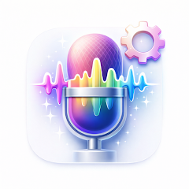

  

<h1 align="center">EchoForge — ボイスチェンジャー</h1>

  <b>100% オフラインのボイスチェンジャー。24 種のエフェクト、カスタム可能なエフェクトチェーン、WhatsApp / Telegram / Discord への直接共有。広告なし、インターネットなし、トラッキングなし。iOS と Android。</b>

  
  

  
  
  
  
  
  

  <b>言語：</b>
  <a href="README.md">English</a> · <a href="README.es.md">Español</a> · <a href="README.pt-BR.md">Português</a> · <a href="README.de.md">Deutsch</a> · <a href="README.fr.md">Français</a> · <a href="README.it.md">Italiano</a> · <a href="README.nl.md">Nederlands</a> · <a href="README.pl.md">Polski</a> · <a href="README.cs.md">Čeština</a> · <a href="README.uk.md">Українська</a> · <a href="README.ru.md">Русский</a> · <a href="README.tr.md">Türkçe</a> · <a href="README.ar.md">العربية</a> · <a href="README.hi.md">हिन्दी</a> · <a href="README.zh-CN.md">中文</a> · <a href="README.ko.md">한국어</a> · <a href="README.id.md">Bahasa Indonesia</a> · <a href="README.vi.md">Tiếng Việt</a> · <a href="README.th.md">ภาษาไทย</a>

---

## EchoForge とは？

**EchoForge** は Android と iPhone のための完全オフライン動作のボイスチェンジャー。声を録音し、24 種類のチューニング済みエフェクトのいずれか（または自作のエフェクトチェーン）を適用し、メッセンジャーへ直接共有できます。録音、処理、音声ファイルのエンコードまですべて端末内で完結。広告なし、アカウント不要、インターネット権限なし、トラッキングなし。

特長は、**重ねられるエフェクトチェーン**。ピッチ、リバーブ、エコー、ディストーション、ビットクラッシュなどをドラッグ＆ドロップで組み合わせ、自分の声として保存できます。多くのアプリはこの機能をサブスクの裏に隠しますが、EchoForge は無料のままです。

## 主な機能

### 24 のボイスプリセット
- **ヘリウム**、**チップマンク**、**ロボット**、**デーモン**、**ゴースト**、**モンスター**、**エイリアン**
- **ディープボイス**、**ジャイアント**、**洞窟**、**スタジアム**、**エコー**
- **Lo-Fi**、**ヴァイナル**、**ささやき**
- **バスルーム**、**Bass Boost**、**Flanger**、**メガホン**、**電話**、**アーケード**、**DJ**
- 独自プリセットの **Custom** スロット

### カスタムチェーン
- **重ねる** — ピッチ、リバーブ、エコー、ディストーション、ビットクラッシュ、EQ
- ドラッグで**並び替え**
- スライダーで**微調整**
- **アンドゥ／リドゥ**
- **保存** して自分のプリセットへ

### 共有
- **WhatsApp**、**Telegram**、**Discord**、**Messenger**、**メール**、**ファイル**

EchoForge は実際の音声ファイルを正しいフォーマットとメタデータで書き出します — 空の添付や壊れた共有はありません。

### プライバシー
- **100% オフライン**
- **広告なし**
- **トラッキングなし**
- **アカウントなし**
- **音声は端末内に**

## 利用シーン

| 場面 | アプリの動作 |
|------|--------------|
| WhatsApp の面白ボイス | 録音 → チップマンク → 共有 |
| ハロウィンメッセージ | 録音 → デーモン + 洞窟 → 共有 |
| Discord メモ | 録音 → ロボット + Bitcrush → Discord |
| ASMR クリップ | 録音 → ささやき → 保存 |
| Telegram のいたずら | 録音 → ヘリウム → ボイスメッセージ |
| オーディオブック試し | 録音 → ディープボイス → 保存 |
| TikTok ナレーション | 録音 → 自作チェーン → 保存 |
| ポッドキャスト OP | 録音 → メガホン / DJ → 保存 |
| 「電話越し」演出 | 録音 → 電話 → 共有 |
| キャラボイス | 録音 → モンスター + Distortion → 保存 |

## 仕組み

**処理はどこで？**
すべて端末内。インターネットは一切不要です。

**録音はアップロードされる？**
されません。

**本当にチェーン化できる？**
できます。

**共有がしっかり動く理由は？**
EchoForge が、形式・サンプリングレート・メタデータの正しい本物の音声ファイルを書き出すからです。

## ダウンロード

| プラットフォーム | ストア | 識別子 |
|------------------|--------|--------|
| Android | [Google Play](https://play.google.com/store/apps/details?id=com.tomas.echoforge_voice_changer) | `com.tomas.echoforge_voice_changer` |
| iOS | [App Store](https://apps.apple.com/us/app/id6761810177) | `id6761810177` |

**サポート：** [github.com/Lapnito/echoforge/issues](https://github.com/Lapnito/echoforge/issues)

## よくある質問

**本当に無料？**
はい。

**アカウントは必要？**
不要です。

**ネットを使う？**
使いません。

**データを集める？**
集めません。

**マイクの権限はなぜ？**
声を録音するためです。

**ファイル／メディアの権限はなぜ？**
書き出した音声ファイルの保存・共有のためです。

**どんな形式で書き出す？**
WhatsApp / Telegram / Discord 等で再生可能な標準形式です。

**最長録音時間は？**
固定の上限なし。

**通話中のリアルタイムは？**
できません。EchoForge は録音済みクリップを変換します。

**対応端末は？**
マイク付きの Android、iOS 13.0 以降の iPhone / iPad。

**バグ報告は？**
[github.com/Lapnito/echoforge/issues](https://github.com/Lapnito/echoforge/issues) または tom@lapnito.cz。

## 技術スタック

- **フレームワーク：** Flutter（Android / iOS）
- **センサー：** マイク
- **処理：** 端末上の DSP（クラウド呼び出しなし）
- **ネットワーク：** 不要
- **最低 Android：** Android 6.0（API 23）
- **最低 iOS：** iOS 13.0
- **本 README の対応言語：** English, Español, Português, Deutsch, Français, Italiano, Nederlands, Polski, Čeština, Українська, Русский, Türkçe, العربية, हिन्दी, 中文, 日本語, 한국어, Bahasa Indonesia, Tiếng Việt, ภาษาไทย

## 開発者について

EchoForge は **lapnito.cz s.r.o.**（Lapnito Development Studio）が開発しています。小さく目的の明確な、広告のないユーティリティをリリースしているチェコのスタジオです。

- **サポート：** [github.com/Lapnito/echoforge/issues](https://github.com/Lapnito/echoforge/issues)
- **メール：** tom@lapnito.cz
- **Google Play の他のアプリ：** [Lapnito Development Studio](https://play.google.com/store/apps/dev?id=8923575656207320763)
- **App Store の他のアプリ：** [lapnito.cz s.r.o.](https://apps.apple.com/us/developer/lapnito-cz-s-r-o/id1577358577)

---

チェコ共和国で ❤️ を込めて — <a href="https://github.com/Lapnito">lapnito.cz s.r.o.</a>

